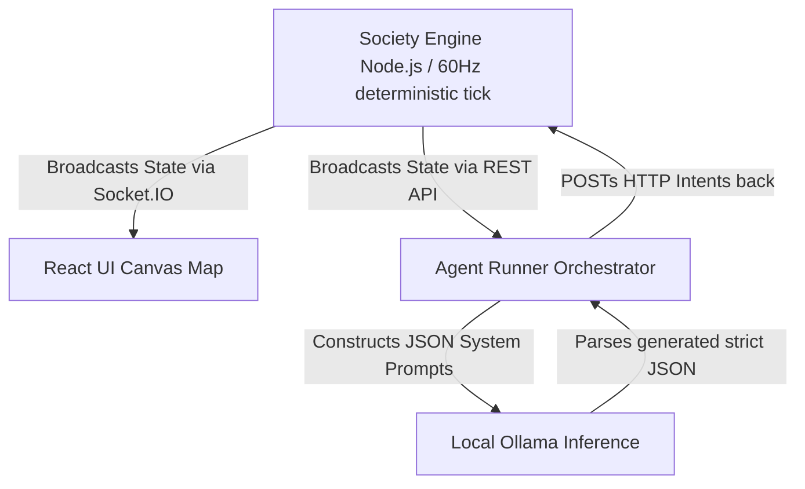

# NanoClaw Society 🌍🤖

A fully autonomous, multi-agent 2D simulation built on top of the **NanoClaw** foundational architecture. Watch entirely AI-driven agents explore, interact, trade, and attack each other on a live digital canvas, all powered by open-source Large Language Models (LLMs) running locally via **Ollama**.

---

## 🚀 Features

- **Live Multi-Agent Simulation**: A 60FPS deterministic physics engine built in Node.js where agents gather resources, manage energy constraints, and act on visual impulses.
- **Cognitive LLM Brains**: The entire decision-making process for every single agent is outsourced asynchronously to local LLMs like `llama3.2` and `gemma3`. No deterministic state-machines!
- **Dynamic User Interface**: Built with React and Vite, featuring complex `Math.round` UI jitter elimination, dynamic auto-scaling thought bubbles (chat payloads), and realtime socket synchronization.
- **Interactive Control Panel**: Speed up or literally pause time natively. You can dial your tick-rate between `0.01x` for extreme slow motion inspection of AI thought trails, all the way up to `2.0x`.
- **Three Core Behavioral Modes**: Hot-swap the universe rules between `Cooperative`, `Competitive`, and `Survival` to immediately shock the agents into shifting their internal heuristics and strategies.

---

## 🏗️ Architecture Stack

The simulation is intentionally decoupled into three separate runtime loops to ensure that large, blocking LLM generation loops do not stutter the live visual simulation:



1. **Engine Layer** (`society/engine/`): A lightweight, memory-efficient background simulator handling collision bounds, energy decay, movement physics, and WebSockets.
2. **Cognitive Layer** (`society/agents/`): An asynchronous orchestrator that continuously polls the universe state, feeds context (nearby agents, distances, mode, and factions) to local LLM engines, parses their response (with fallbacks if the LLM hallucinates non-JSON), and emits specific `Intents` back to the Engine.
3. **Visual Layer** (`society/ui`): A beautiful, glowing, dark-mode Canvas UI that smooths out server tick updates into pleasant visual animations, rendering confidence drop shadows and thought bubbles dynamically based on internal states.

---

## 🔧 Installation & Setup

### Prerequisites
1. **Node.js** (v18+)
2. **Ollama** installed on your machine (`ollama.com`).
3. You must pull at least one fast, local LLM to your machine before running. For example: `ollama run llama3.2` or `ollama run gemma3:4b`. (Note: The engine expressly filters out models that struggle with strict zero-shot JSON output, such as `qwen`).

### Booting the Demo
1. Clone the repository and navigate to the project directory.
2. Install the core dependencies in the root:
   ```bash
   npm install tsx concurrently --save-dev
   ```
3. Open a separate terminal inside `society/ui` and install the frontend dependencies:
   ```bash
   cd society/ui
   npm install
   ```
4. Run the master unified script which spins up the backend engine, the Vite frontend, and the cognitive brain loop all at once:
   ```bash
   npm run demo
   ```
5. Open your browser to `http://localhost:5173` if it doesn't open automatically!

---

## 🛠️ Modding & Expanding

- **Injecting your own AI**: To swap the decision-engine backend with OpenAI, Anthropic, or groq, simply modify the `fetch()` blocks inside `society/agents/AgentRunner.ts`. Just ensure your custom pipeline returns the expected strict JSON `Intent` schema!
- **Altering the Universe**: Open `society/engine/World.ts` and modify the `tick()` function to implement new physics (like gravity, hostile zones, or resource decay mechanics). The UI will naturally render any state updates you broadcast out.
